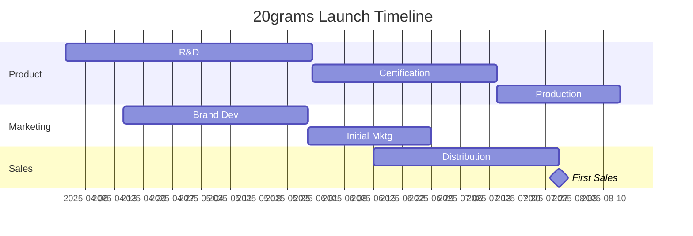

# 20grams: The Protein Revolution India Can Chew On 🚀

  
<i>"20 grams of power, 50 rupees of grit, one bite of genius."</i>

  

## 📊 The Protein Gap in India

India faces a significant protein challenge that 20grams aims to solve:

| Metric | Value |
|--------|-------|
| Urban youth engaged in fitness | 80% |
| Rural diets lacking adequate protein | 70% |
| Protein snack market by 2025 | ₹2,000 crore |
| Population that can afford existing protein bars | Only 20% |

  

  

## 🔥 The Problem

Current protein bars in the Indian market:
- **MuscleBlaze**: ₹120-150 per bar
- **YogaBar**: ₹110-130 per bar
- **Imported brands**: ₹150+ per bar

These prices make protein supplementation inaccessible to the majority of Indians, creating a massive gap in the market.

  

## 💪 Our Solution: 20grams

### The Core Promise:
- **20 grams** of high-quality protein
- Only **₹50** per bar (less than half the price of competitors)
- Uniquely Indian ingredients and flavors
- Four-layer texture experience

### The Revolutionary Layers

  

## 📈 Market Opportunity

The Indian protein market is expanding rapidly:
- **Growth rate**: 10-12% annually
- **Market size by 2025**: ₹2,000 crore
- **Target audience**: 50 million potential customers

  

## 💰 The Economics

### Cost Breakdown

```mermaid
pie title Cost Per Bar (₹)
    "Ingredients" : 22
    "Packaging" : 3
```

### Financial Projections

| Metric | Value |
|--------|-------|
| Production cost | ₹25 per bar |
| Selling price | ₹50 per bar |
| Profit margin | 100% |
| Monthly target (Year 1) | 10,000 bars |
| Monthly profit (Year 1) | ₹2.5 lakh |
| Year 1 target revenue | ₹60 lakh |
| Year 1 target profit | ₹30 lakh |

  

## 🌍 The Vision

20grams isn't just a protein bar—it's a movement to democratize nutrition in India:

1. **Make protein accessible** to all income levels
2. **Showcase India's superfoods** on a global stage
3. **Support local farmers** growing amaranth and other ingredients
4. **Challenge the status quo** of premium-priced nutrition

By Year 3, we aim to disrupt the entire protein snack market with:
- **Production**: 1 lakh bars/month
- **Revenue**: ₹25 crore
- **Export markets**: USA, UAE, Singapore

  

## 👥 Team & Requirements

Currently a solo vision seeking:
- Food technology experts
- Marketing specialists
- Supply chain partners
- Distribution network builders

  

## 💼 Investment Opportunity

### The Ask: Support to accelerate my venture's growth.

### Return Offering:
- Equity stake in a disruptive nutrition startup
- Ground-floor opportunity in India's protein revolution
- Projected 100% profit margins at scale

  

## 🔥 The Call to Action

**20 grams of protein. 50 rupees of rebellion. One bite to change it all.**

Join us in making protein populist, not posh.

  
<b>India's ready. The world's waiting. Are you in?</b>

